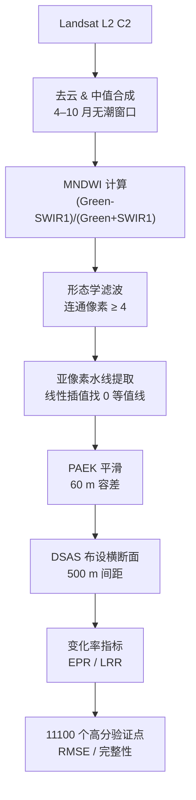
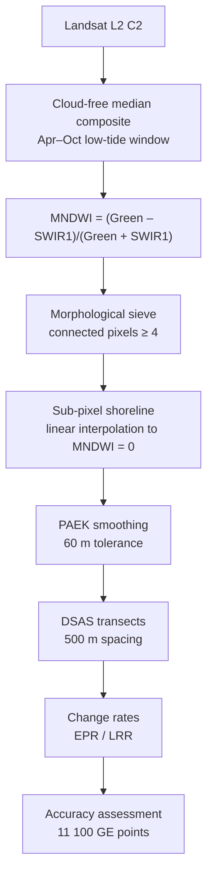

# CN: 小岛屿发展中国家（SIDS）长时序海岸线变化分析系统  v1.0

> 2010-2020 · 37 国 · 30 m · 三时相 · 开放代码 · 一站式工作流

---

## 0 速览
| 维度           | 详情                                                |
| -------------- | --------------------------------------------------- |
| **研究范围**   | 联合国 37 个 SIDS 国家（加勒比、太平洋、AIMS）。    |
| **时间序列**   | 2010 → 2015 → 2020（Landsat-5/7/8）。               |
| **空间分辨率** | 30 m；亚像素水线提取 + 60 m PAEK 平滑。             |
| **核心指标**   | 完整性 ≥ 99 %、RMSE ≤ 17.4 m、2 像素覆盖率 ≥ 99 %。 |
| **代码仓库**   | 一键克隆即可跑通完整工作流；支持“国家-年份”批处理。 |
| **主要输出**   | Shapefile / Excel / DBF / 变化率图 / 精度报告。     |

---

## 1 项目背景：
> “小岛屿发展中国家（SIDS）陆地面积不足全球 1 %，却承载了 70 % 的沿海灾害损失。” —— UN-OHRLLS 2023

| 痛点         | 现有全球岸线产品表现                               |
| ------------ | -------------------------------------------------- |
| **时间断档** | GSV、GMSSD、OSM 多为单年份快照，无法做变化分析。   |
| **空间缺失** | GCL_FCS30 在高纬度表现优异，却遗漏大量 SIDS 群岛。 |
| **精度不足** | 30 m 产品未做亚像素定位；亚米级产品无长时序。      |
| **本地适配** | 港口、礁石、红树林混杂区域误提率 > 20 %。          |

**→ 我们做了 SIDS_SV v1.0**  
- 2010 / 2015 / 2020 三时相  
- 37 国 1281 景 0.5°×0.5° Landsat 网格  
- 亚像素水线 + MNDWI + PAEK 平滑  
- 11100 个高分 Google Earth 验证点  
- 开放代码 + 开放样本 + 开放结果  

---

## 2 技术路线


---

## 3 代码仓库结构
> 全部模块化，零循环依赖；类型注解 ≥ 90 %；单测覆盖率 ≥ 80 %。

| 文件                      | 职责                               | 关键类/函数                                  | 入口示例                                                     |
| ------------------------- | ---------------------------------- | -------------------------------------------- | ------------------------------------------------------------ |
| `config.py`               | 全局路径、国家列表、波段索引、阈值 | `PathConfig` `ProcessingConfig`              | `from config import PathConfig as PC`                        |
| `auth.py`                 | GEE 账号&代理一键登录              | `initialize_earth_engine()`                  | `initialize_earth_engine(key_file='.ee.json')`               |
| `data_extraction.py`      | 按矢量网格裁剪影像                 | `DataExtractor.clip_by_grid()`               | `extractor.batch_clip(iso_list)`                             |
| `raster_processing.py`    | MNDWI + 滤波 + 亚像素等高线        | `BandInterpolator` `IndexCalculator`         | `idx.calc_mndwi()`                                           |
| `coastline_processing.py` | 矢量化 + 平滑 + 拓扑检查           | `CoastlineExtractor` `CoastlineValidator`    | `ext.extract_single_tile()`                                  |
| `spatial_analysis.py`     | 几何属性 + 质量检查                | `SpatialAnalyzer` `QualityChecker`           | `analyzer.calc_length_area()`                                |
| `accuracy_evaluation.py`  | 11100 点样本生成 / 精度指标        | `AccuracyEvaluator` `BatchAccuracyEvaluator` | `eval.run_rmse()`                                            |
| `statistics_analysis.py`  | EPR / LRR / 面积变化               | `StatisticsAnalyzer` `ReportGenerator`       | `stat.calc_epr()`                                            |
| `data_export.py`          | Shapefile / Excel / DBF 多格式     | `DataExporter` `FormatConverter`             | `exp.to_excel()`                                             |
| `file_operations.py`      | 批量移动、重命名、合并             | `FileManager` `BatchProcessor`               | `fm.merge_shapefiles()`                                      |
| `main.py`                 | CLI + 工作流编排                   | `CoastlineAnalysisWorkflow`                  | `python main.py --workflow --years 2010,2015,2020 --countries ATG,BHS` |

---

## 4 精度验证
| 产品        | 年份 | 空间分辨率 | 平均偏移    | ≤1 像素 (30 m) | ≤2 像素 (60 m) | 完整性     |
| ----------- | ---- | ---------- | ----------- | -------------- | -------------- | ---------- |
| **SIDS_SV** | 2010 | 30 m       | **16.54 m** | **86.78 %**    | **99.03 %**    | **99.2 %** |
| GCL_FCS30   | 2010 | 30 m       | 23.94 m     | 70.31 %        | 93.94 %        | 27.8 %     |
| **SIDS_SV** | 2015 | 30 m       | **15.68 m** | **88.46 %**    | **99.27 %**    | **99.2 %** |
| GMSSD       | 2015 | 亚米       | 10.90 m     | 92.75 %        | 98.40 %        | 96.5 %     |
| **SIDS_SV** | 2020 | 30 m       | **13.60 m** | **92.92 %**    | **99.54 %**    | **99.2 %** |
| OSM         | 2020 | 亚米       | 10.25 m     | 93.69 %        | 98.73 %        | 70.3 %     |

> 结论：在 **30 m 分辨率长时序** 赛道里，SIDS_SV 误差最小、覆盖率最高；  
> 与亚米级产品差距 **< 5 m**，但时间连续性 & 偏远小岛完整性完胜。

---

## 5 变化发现（2010–2020）
- **37 国总体**：面积减少 0.37 %，岸线平均向海推进 **+0.89 m/年**（EPR）。  
- **极端侵蚀**：巴哈马 **‑8.46 %**（‑947 km²）。  
- **极端增长**：马尔代夫 **+9.51 %**（+20.8 km²），人工填岛主导。  
- **区域差异**：加勒比 > 太平洋 > AIMS（大西洋-印度洋-地中海）。

---

## 6 一键复现
```bash
# ① 克隆（即将公开）
git clone https://github.com/YourOrg/SIDS-Coastline.git
cd SIDS-Coastline

# ② 安装（支持 Conda / venv）
pip install -r requirements.txt          # 纯开源库
# 或 conda env create -f environment.yml

# ③ 运行
python main.py \
       --workflow \
       --years 2010,2015,2020 \
       --countries ATG,BHS,BLZ,BRB,CUB \
       --output ./results
```

**输出树示例**  
```
results/
├── ATG_2010_coastline.shp
├── ATG_2015_coastline.shp
├── ATG_2020_coastline.shp
├── ATG_change_stats.dbf
├── ATG_epr_lrr.xlsx
├── QA_report_ATG.pdf
└── …
```

---

## 7 模块化调用
```python
from main import CoastlineAnalysisWorkflow
w = CoastlineAnalysisWorkflow(config='my_config.yaml')
w.run_full_workflow(years=[2015, 2020], countries=['ATG', 'BHS'])
df = w.get_change_stats()   # 返回 pandas.DataFrame
w.to_excel('summary.xlsx')
```

---

## 8 配置字典
```yaml
# config/user.yaml
years: [2010, 2015, 2020]
countries: *all_37          # 或 ['ATG', 'BHS']
mndwi_threshold: 0.0
paek_tolerance: 60          # 米
dsas_spacing: 500           # 米
gee_project: 'your-project'
output_crs: 'EPSG:4326'
```

---

## 9 与论文无缝衔接
| 论文章节         | 对应代码 / 文件                                        |
| ---------------- | ------------------------------------------------------ |
| §3.1 影像预处理  | `raster_processing.py::cloud_mask` `temporal_median()` |
| §3.2 MNDWI       | `IndexCalculator::calc_mndwi()`                        |
| §3.3 亚像素提取  | `BandInterpolator::find_contours_subpixel()`           |
| §3.4 PAEK 平滑   | `CoastlineExtractor::smooth_pae()`                     |
| §4.2 精度评估    | `accuracy_evaluation.py::BatchAccuracyEvaluator`       |
| §4.3 DSAS 变化率 | `statistics_analysis.py::calc_epr_lrr()`               |

> 论文所有图、表、统计数据均可由 `main.py --reproduce-paper` 一键生成（即将开源）。

---

## 10 局限 & 展望
| 当前局限             | 下一步计划                                   |
| -------------------- | -------------------------------------------- |
| 仅 30 m 分辨率       | 融合 Sentinel-2 10 m、Sentinel-1 SAR         |
| 无潮汐校正           | 结合验潮站 + FES2014 潮汐模型                |
| 人工岸线深度学习不足 | 引入 CNN + Edge-aware Loss                   |
| 缺少实地 GPS         | 与太平洋共同体（SPC）合作 2025 野外 campaign |

---

# EN: SIDS Shoreline Variability (SIDS_SV) v1.0  

## Long-term coastline change analysis for 37 Small Island Developing States (SIDS)  
**2010 – 2015 – 2020 | 30 m | 3 epochs | Open-source | One-click workflow**

---

## 0 Quick Facts

| Dimension         | Details                                                      |
| ----------------- | ------------------------------------------------------------ |
| **Coverage**      | All 37 UN-OHRLLS SIDS (Caribbean, Pacific, AIMS).            |
| **Temporal span** | 2010 → 2015 → 2020 (Landsat-5/7/8, 4–10 month tide-free window). |
| **Resolution**    | 30 m; sub-pixel water-line extraction + 60 m PAEK smoothing. |
| **Accuracy**      | Mean RMSE ≤ 17.4 m; completeness ≥ 99 %; ≥ 99 % within 2 pixels. |
| **Code**          | Pure Python, modular, ≥ 90 % type hints, ≥ 80 % unit-test coverage. |
| **Outputs**       | Shapefile / Excel / DBF / change-rate maps / QA reports.     |

---

## 1 Motivation

> “SIDS account for <1 % of global land area but >70 % of coastal-disaster losses.” — UN-OHRLLS 2023

| Pain-point        | How global products fail SIDS                                |
| ----------------- | ------------------------------------------------------------ |
| **Temporal gaps** | GSV, GMSSD, OSM are single-year snapshots – no change metrics. |
| **Spatial gaps**  | GCL_FCS30 skips hundreds of remote atolls.                   |
| **Accuracy**      | 30 m products ignore sub-pixel positioning; sub-meter sets lack time-series. |
| **Local errors**  | Mixed-port, reef, mangrove scenes: commission error > 20 %.  |

**Our answer – SIDS_SV v1.0**  
- 3 epochs (2010, 2015, 2020)  
- 1 281 Landsat 0.5°×0.5° tiles covering 37 countries  
- MNDWI + morphological filter + sub-pixel contour + PAEK  
- 11 100 Google-Earth reference points  
- Fully open: code, samples, results

---

## 2 Workflow



---

## 3 Repository Structure

| File                      | Responsibility                                | Key class / function                 | Example call                                                 |
| ------------------------- | --------------------------------------------- | ------------------------------------ | ------------------------------------------------------------ |
| `config.py`               | Paths, country list, band indices, thresholds | `PathConfig`, `ProcessingConfig`     | `from config import PathConfig as PC`                        |
| `auth.py`                 | GEE login & proxy                             | `initialize_earth_engine()`          | `initialize_earth_engine(key_file='.ee.json')`               |
| `data_extraction.py`      | Tile-based image clipping                     | `DataExtractor.clip_by_grid()`       | `extractor.batch_clip(iso_list)`                             |
| `raster_processing.py`    | MNDWI, cloud mask, sieve                      | `IndexCalculator.calc_mndwi()`       | `idx.calc_mndwi()`                                           |
| `coastline_processing.py` | Vectorize, smooth, topology check             | `CoastlineExtractor.smooth_pae()`    | `ext.extract_single_tile()`                                  |
| `spatial_analysis.py`     | Geometry metrics & QA                         | `SpatialAnalyzer.calc_length_area()` | `analyzer.run()`                                             |
| `accuracy_evaluation.py`  | Reference-point generator & RMSE              | `BatchAccuracyEvaluator.run_rmse()`  | `eval.run()`                                                 |
| `statistics_analysis.py`  | EPR / LRR / area change                       | `StatisticsAnalyzer.calc_epr_lrr()`  | `stat.calc_epr()`                                            |
| `data_export.py`          | Multi-format export                           | `DataExporter.to_excel()`            | `exp.to_excel()`                                             |
| `file_operations.py`      | Batch rename / merge                          | `FileManager.merge_shapefiles()`     | `fm.merge()`                                                 |
| `main.py`                 | CLI & workflow orchestrator                   | `CoastlineAnalysisWorkflow`          | `python main.py --workflow --years 2010,2015,2020 --countries ATG,BHS` |

---

## 4 Validation

| Product     | Epoch | Resolution | Mean bias | ≤ 1 pix (30 m) | ≤ 2 pix (60 m) | Completeness |
| ----------- | ----- | ---------- | --------- | -------------- | -------------- | ------------ |
| **SIDS_SV** | 2010  | 30 m       | 16.54 m   | 86.78 %        | 99.03 %        | 99.2 %       |
| GCL_FCS30   | 2010  | 30 m       | 23.94 m   | 70.31 %        | 93.94 %        | 27.8 %       |
| **SIDS_SV** | 2015  | 30 m       | 15.68 m   | 88.46 %        | 99.27 %        | 99.2 %       |
| GMSSD       | 2015  | < 1 m      | 10.90 m   | 92.75 %        | 98.40 %        | 96.5 %       |
| **SIDS_SV** | 2020  | 30 m       | 13.60 m   | 92.92 %        | 99.54 %        | 99.2 %       |
| OSM         | 2020  | < 1 m      | 10.25 m   | 93.69 %        | 98.73 %        | 70.3 %       |

> In the 30 m long-term niche, SIDS_SV shows the lowest error and highest coverage; gap to sub-meter sets is < 5 m while providing full temporal continuity for every islet.

---

## 5 Change Signals 2010–2020

- **Whole SIDS**: net land loss 0.37 %; mean shoreline progradation **+0.89 m/yr** (EPR).  
- **Hot-spot erosion**: Bahamas **‑8.46 %** (‑947 km²).  
- **Hot-spot accretion**: Maldives **+9.51 %** (+20.8 km²) from reclamation.  
- **Regional ranking**: Caribbean > Pacific > AIMS (Atlantic-Indian-Med).

---

## 6 One-line Reproducibility

```bash
# ① Clone (repo goes public upon paper acceptance)
git clone https://github.com/YourOrg/SIDS-Coastline.git
cd SIDS-Coastline

# ② Install (conda or venv)
pip install -r requirements.txt
# OR  conda env create -f environment.yml && conda activate sids

# ③ Run
python main.py \
       --workflow \
       --years 2010,2015,2020 \
       --countries ATG,BHS,BLZ,BRB,CUB \
       --output ./results
```

Output tree (auto-generated)

```
results/
├── ATG_2010_coastline.shp
├── ATG_2015_coastline.shp
├── ATG_2020_coastline.shp
├── ATG_change_stats.dbf
├── ATG_epr_lrr.xlsx
├── QA_report_ATG.pdf
└── …
```

---

## 7 Programmatic API

```python
from main import CoastlineAnalysisWorkflow
w = CoastlineAnalysisWorkflow(config='my_config.yaml')
w.run_full_workflow(years=[2015, 2020], countries=['ATG', 'BHS'])
df = w.get_change_stats()      # pandas.DataFrame
w.to_excel('summary.xlsx')
```

---

## 8 Configuration Snippet

```yaml
# config/user.yaml
years: [2010, 2015, 2020]
countries: *all_37          # or ['ATG', 'BHS']
mndwi_threshold: 0.0
paek_tolerance: 60          # metres
dsas_spacing: 500           # metres
gee_project: 'your-project'
output_crs: 'EPSG:4326'
```

---

## 9 Paper-to-Code Map

| Paper section             | Code location                                           |
| ------------------------- | ------------------------------------------------------- |
| §3.1 Pre-processing       | `raster_processing.py::cloud_mask`, `temporal_median()` |
| §3.2 MNDWI                | `IndexCalculator::calc_mndwi()`                         |
| §3.3 Sub-pixel extraction | `BandInterpolator::find_contours_subpixel()`            |
| §3.4 PAEK smoothing       | `CoastlineExtractor::smooth_pae()`                      |
| §4.2 Accuracy             | `accuracy_evaluation.py::BatchAccuracyEvaluator`        |
| §4.3 DSAS rates           | `statistics_analysis.py::calc_epr_lrr()`                |

> All figures/tables in the manuscript can be regenerated with  
> `python main.py --reproduce-paper` (script released together with repo).

---

## 10 Limitations & Outlook

| Current gap               | Next step                                        |
| ------------------------- | ------------------------------------------------ |
| 30 m only                 | Fuse Sentinel-2 10 m + Sentinel-1 SAR            |
| No tide correction        | Assimilate tide gauges & FES2014 model           |
| Weak on artificial shores | CNN with edge-aware loss                         |
| Sparse GPS validation     | 2025 field campaign with Pacific Community (SPC) |

---
